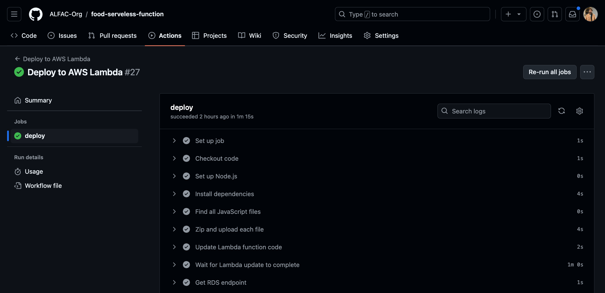

# Funções Serveless - ALFAC

Este é um repositório Git que utiliza as configurações anteriormente criadas pelo repositório [https://github.com/ALFAC-Org/food-cloud-infra](https://github.com/ALFAC-Org/food-cloud-infra) para aplicar as configurações faltantes para a provisão de recursos de *funções lambdas* ou *funções serveless*  da aplicação [Fast Food - ALFAC](https://github.com/ALFAC-Org/food). Nele, você encontrará as lambdas que são executadas na aplicação, bem como o fluxo para a atualização destes códigos. No momento, o repositório está focado na Amazon Web Services (AWS), usando as funções lambdas. Entretanto, o repositório é flexível para adaptação para outros provedores de funções serveless.

> [!WARNING]  
> **Para completo funcionamento do sistema, é necessário seguir todo o fluxo de provisionamento: 1. A provisão do repositório de infraestrutura [https://github.com/ALFAC-Org/food-cloud-infra](https://github.com/ALFAC-Org/food-cloud-infra); 2. A provisão do repositório de banco de dados [https://github.com/ALFAC-Org/food-database](https://github.com/ALFAC-Org/food-database); 3. A provisão deste repositório; 4. E por fim, a o provisionamento da aplicação principal, utilizando de todos os recursos anteriormente criados em [https://github.com/ALFAC-Org/food](https://github.com/ALFAC-Org/food)**

## Conceito

Toda a infraestrutura é criada no repositório [https://github.com/ALFAC-Org/food-cloud-infra](https://github.com/ALFAC-Org/food-cloud-infra), haja visto que é necessário a obtenção de informações de VPC, API Gateways, grupos de acesso e entre outros. Com isso, este repositório fica responsável por de fato, atualizar o código que será utilizado pela a aplicação.

De modo geral, as lambdas ficarão responsáveis por provisionar a identificação e autenticação do usuário através do CPF dentro da plataforma.

## Como rodar o projeto

- **Via GitHub Actions**

  
Passo a passo

1. Acesse [https://github.com/ALFAC-Org/food-serveless/actions](https://github.com/ALFAC-Org/food-serveless/actions) (A guia `Actions` deste repositório);
2. Acesse `Deploy to AWS Lambda`;
3. Clique em `Run workflow` (ou Executar workflow);
4. Aguarde. Se tudo der certo, o `check` verde deverá aparecer - o processo dura em torno de 2 a 5 minutos;
   1. 
   2. 

### Recursos provisionados

Os seguintes recursos serão criados/atualizados:

- Lambdas: novo código/versão, bem como variáveis ambiente necessárias para estas lambdas.

### Acessando as lambdas

Você saberá que tudo estará bem, quando acessar a aplicação principal [https://github.com/ALFAC-Org/food](https://github.com/ALFAC-Org/food) acessando a url do Load Balancer e então tentando cadastrar ou obter alguma informação do sistema.

Ou então acessando ao console AWS e verificando pelas lambdas criadas.
