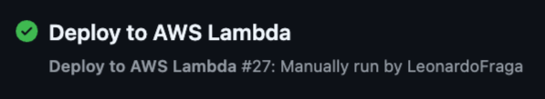

# Funções Serveless - ALFAC

Este é um repositório git que utiliza as configurações anteriormente criadas pelo repositório [https://github.com/ALFAC-Org/food-cloud-infra](https://github.com/ALFAC-Org/food-cloud-infra) para aplicar as configurações faltantes para a provisão de recursos de *funções lambdas* ou *funções serveless*  da aplicação [Fast Food - ALFAC](https://github.com/ALFAC-Org/food). Nele, você encontrará as lambdas que são executadas na aplicação, bem como o fluxo para a atualização destes códigos. No momento, o repositório está focado na Amazon Web Services (AWS), usando as funções lambdas. Entretanto, o repositório é flexível para adaptação para outros provedores de funções serveless.

> [!WARNING]
> Para completo funcionamento da plataforma, é necessário seguir todo o fluxo de provisionamento:
> 1. A provisão do repositório de infraestrutura: [https://github.com/ALFAC-Org/food-cloud-infra](https://github.com/ALFAC-Org/food-cloud-infra);
> 2. A provisão do repositório dos bancos de dados: [https://github.com/ALFAC-Org/food-database](https://github.com/ALFAC-Org/food-database);
> 3. A provisão deste repositório;
> 4. A provisão das aplicações:
  >    1. [https://github.com/ALFAC-Org/food-cliente](https://github.com/ALFAC-Org/food-cliente);
  >    2. [https://github.com/ALFAC-Org/food-produto](https://github.com/ALFAC-Org/food-produto);
> 5. E por fim, o provisionamento da aplicação principal em [https://github.com/ALFAC-Org/food](https://github.com/ALFAC-Org/food).

## Conceito

Toda a infraestrutura é criada no repositório [https://github.com/ALFAC-Org/food-cloud-infra](https://github.com/ALFAC-Org/food-cloud-infra), haja visto que é necessário a obtenção de informações de VPC, API Gateways, grupos de acesso e entre outros. Com isso, este repositório fica responsável por de fato, atualizar o código que será utilizado pela a aplicação.

De modo geral, as lambdas ficarão responsáveis por provisionar a identificação e autenticação do usuário através do CPF dentro da plataforma.

## Tutoriais

| Passo                                                                                                                                    | Vídeo                                                                                                                                                                                                                                 |
|------------------------------------------------------------------------------------------------------------------------------------------|---------------------------------------------------------------------------------------------------------------------------------------------------------------------------------------------------------------------------------------|
| 0. Introdução geral                                                                                                                      | [00-INTRODUCAO_GERAL](https://drive.google.com/file/d/13cn5Z7FZzmkuh7Qo-Y28Z0EYblrOIwRw/view?usp=sharing)                                                                                                                             |
| 1. Introdução aos repositórios                                                                                                           | [01-INTRODUCAO_AOS_REPOSITORIOS](https://drive.google.com/file/d/1YMbt2wP6e9ZTgohPGcBUdwVdxEM2eARD/view?usp=sharing)                                                                                                                  |
| 2. Configuração das variáveis ambiente                                                                                                   | [02-CONFIGURACAO_VARIAVEIS_AMBIENTE](https://drive.google.com/file/d/1pnvF8psjq648Hrk1QU6T_vryq6WkDpC3/view?usp=sharing)                                                                                                              |
| 3. Provisão da infraestrutura com [https://github.com/ALFAC-Org/food-cloud-infra](https://github.com/ALFAC-Org/food-cloud-infra)         | [03-PROVISAO_INFRA_P1](https://drive.google.com/file/d/1RO3DKyr7qyglsGnLnfbETU2rNS2WrM2k/view?usp=sharing) / [03-PROVISAO_INFRA_P2](https://drive.google.com/file/d/1dxIx_XCkQ9s_It_JyRBPpilf5wwh6SEe/view?usp=sharing)               |
| 4. Provisão dos bancos de dados com [https://github.com/ALFAC-Org/food-database](https://github.com/ALFAC-Org/food-database)             | [04-PROVISAO_DB_P1](https://drive.google.com/file/d/1xSe8PQLalyHxy3Pn8XOu3g5v9cOUS4jN/view?usp=sharing) / [04-PROVISAO_DB_P2](https://drive.google.com/file/d/1V_NOCmLwTr8kaZIh56gciOPsf_hsCWUP/view?usp=sharing)                     |
| 5. Provisão das lambdas com [https://github.com/ALFAC-Org/food-serveless-function](https://github.com/ALFAC-Org/food-serveless-function) | [05-PROVISAO_LAMBDAS_P1](https://drive.google.com/file/d/1823lFmz1yaIKIr5s9D8B5prlJcAu4rL0/view?usp=sharing) / [05-PROVISAO_LAMBDAS_P1](https://drive.google.com/file/d/1Nd89oZSWY7JiHjz1RMSN33OU87G0C0pG/view?usp=sharing)           |
| 6. Provisão da aplicação food-produto [https://github.com/ALFAC-Org/food-produto](https://github.com/ALFAC-Org/food-produto)             | [06-PROVISAO_FOOD_PRODUTO_P1](https://drive.google.com/file/d/1_wtyYeHCGJmqkt6kaxhDAm4K21J2apxS/view?usp=sharing) / [06-PROVISAO_FOOD_PRODUTO_P2](https://drive.google.com/file/d/1oFmnhd6c6t9OG7-YzLDs6Ua65qedv3O6/view?usp=sharing) |
| 7. Provisão da aplicação food-cliente [https://github.com/ALFAC-Org/food-cliente](https://github.com/ALFAC-Org/food-cliente)             | [07-PROVISAO_FOOD_CLIENTE_P1](https://drive.google.com/file/d/1x_k4ce2Rexn3E5dnmQJrnhFS6orTdNOK/view?usp=sharing) / [07-PROVISAO_FOOD_CLIENTE_P2](https://drive.google.com/file/d/1WA3WTTX3FD6f-mM6UiV3gLq7IqI7Pik3/view?usp=sharing) |
| 8. Provisão da aplicação principal com [https://github.com/ALFAC-Org/food](https://github.com/ALFAC-Org/food)                            | [08-PROVISIONA_FOOD_P1](https://drive.google.com/file/d/18fwyjMtbWwi4nOUinI-7_72hkPy1YxS8/view?usp=sharing) / [08-PROVISIONA_FOOD_P2](https://drive.google.com/file/d/14Pw2Z9QN9hvKGe40A8mh5OwhgnYl2HwX/view?usp=sharing)             |
| 9. Simulando cliente na plataforma: Load Balancer e API Gateway                                                                          | [09-01_FLUXO_LOAD_BALANCER](https://drive.google.com/file/d/1kUniYudGX6BF6-E_fMayjjyV_pWH1rKr/view?usp=sharing) / [09-02_FLUXO_API_GATEWAY](https://drive.google.com/file/d/1SDrMZ_a94kCGd-VggUDn7TmByYVf3MtU/view?usp=sharing)       |

Todos os vídeos estão disponíveis também aqui: [https://drive.google.com/drive/folders/1C9UbKeiVNRIM7CSv-HMgMHZflwbqI5tQ?usp=sharing](https://drive.google.com/drive/folders/1C9UbKeiVNRIM7CSv-HMgMHZflwbqI5tQ?usp=sharing)

## Como rodar o projeto

- **Via GitHub Actions**

  
Passo a passo

1. Acesse [https://github.com/ALFAC-Org/food-serveless/actions](https://github.com/ALFAC-Org/food-serveless/actions) (A guia `Actions` deste repositório);
2. Acesse `Deploy to AWS Lambda`;
3. Clique em `Run workflow` (ou Executar workflow);
4. Aguarde. Se tudo der certo, o `check` verde deverá aparecer - o processo dura em torno de 2 a 5 minutos;
   1. 
   2. 

### Recursos provisionados

Os seguintes recursos serão criados/atualizados:

- Lambdas: novo código/versão, bem como variáveis ambiente necessárias para estas lambdas.

### Acessando as lambdas

Você saberá que tudo estará bem, quando acessar a aplicação principal [https://github.com/ALFAC-Org/food](https://github.com/ALFAC-Org/food) acessando a url do Load Balancer e então tentando cadastrar ou obter alguma informação do sistema.

Ou então acessando ao console AWS e verificando pelas lambdas criadas.

## Membros

| Nome | RM | E-mail | GitHub |
| --- | --- | --- | --- |
| Leonardo Fraga | RM354771 | [rm354771@fiap.com.br](mailto:rm354771@fiap.com.br) | [@LeonardoFraga](https://github.com/LeonardoFraga) |
| Carlos Henrique Carvalho de Santana | RM355339 | [rm355339@fiap.com.br](mailto:rm355339@fiap.com.br) | [@carlohcs](https://github.com/carlohcs) |
| Leonardo Alves Campos | RM355568 | [rm355568@fiap.com.br](mailto:rm355568@fiap.com.br) | [@lcalves](https://github.com/lcalves) |
| Andre Musolino | RM355582 | [rm355582@fiap.com.br](mailto:rm355582@fiap.com.br) | [@amusolino](https://github.com/amusolino) |
| Caio Antunes Gonçalves | RM354913 | [rm354913@fiap.com.br](mailto:rm354913@fiap.com.br) | [@caio367](https://github.com/caio367) |
